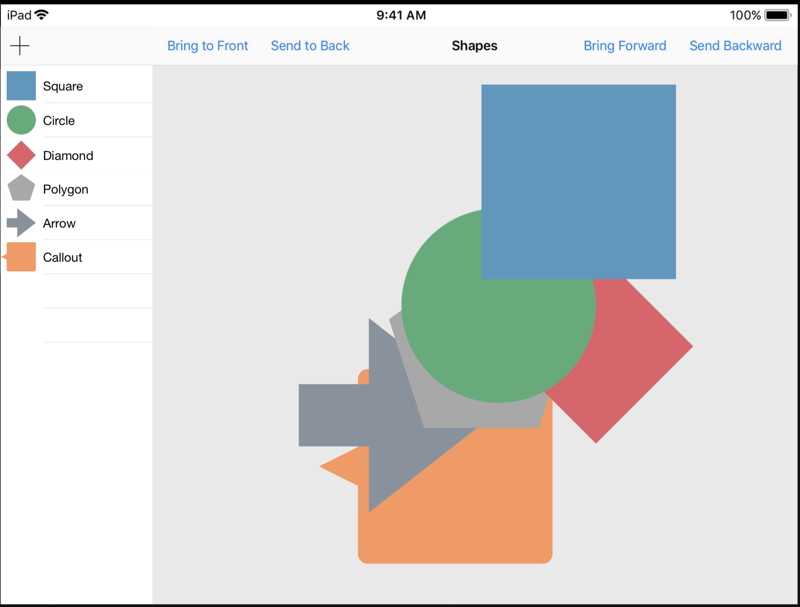
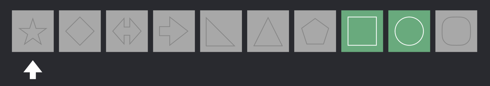

# Embracing Algorithm

*wwdc2018* 
*session*

* Dave Abrahams

---
## Dave and Crusty
这位老兄每次都要装作自己很无知的样子，Crusty 就是哪位指点迷津的扫地僧。
于是我们的 Dave 又遇到问题了。

## Delete Selection

这位老兄对图形情有独钟，每次都拿形状举例子。这次做了个各种形状层叠的App。

第一段代码功能很简单，从图形数组中，删除选中的形状。



```swift
extension Canvas {
    mutating func deleteSelection() {
        for i in 0..<shapes.count {
            if shapes[i].isSelected {
                shapes.remove(at: i)
            }
        }
    }
}
```

这段代码的问题是，要删除的图形如果不是数组的最后一个元素，i 执行到 count - 1 时，数据就会越界。

于是，Dave 将代码修改如下：

```swift
extension Canvas {
    mutating func deleteSelection() {
        var i = 0
        while i < shapes.count {
            if shapes[i].isSelected {
                shapes.remove(at: i)
            }
            i += 1
        }
    }
}
```

这段代码也有 bug，如果两个要删的元素（绿色块）连在一起，第二个绿会，会被忽略。

于是要在 if 后面避免这种情况，如下：

```swift
extension Canvas {
    mutating func deleteSelection() {
        var i = 0
        while i < shapes.count {
            if shapes[i].isSelected {
                shapes.remove(at: i)
            } else {
                i += 1
            }
        }
    }
}
```
写一个看似简单的功能，也有挺大的认知负担。